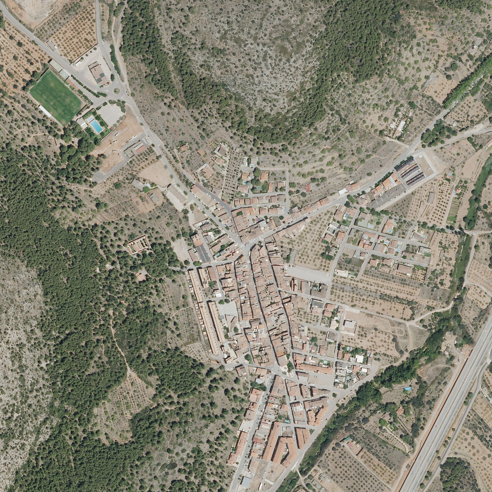

# La Pobla Tornesa imagery references

Six real satellite and aerial images of La Pobla Tornesa, Castellón, Spain, downloaded from Spain's official IGN/CNIG services on **7 September 2026**. Use them as visual references for the town, roads, roofs, fields and surrounding hills in Malandrins. All images face north, with east on the right.

For photographs taken at street level, see the companion **[street-data/](../street-data/README.md)** folder.

Start with **05** to compare against the game map, or **06** for town-center detail. The JPEGs are saved exactly as returned by the imagery services, with no local image editing or generated content. They are stored outside `public/` and are not loaded by the game.

## Images

| File | Coverage | Dimensions | Reference use |
| --- | --- | --- | --- |
| [01 — Sentinel-2, winter 2026](01-satellite-region-winter-2026.jpg) | Approximately 12 × 12 km | 1536 × 1536 | Regional terrain, vegetation and settlement relationships |
| [02 — Sentinel-2, summer 2024](02-satellite-region-summer-2024.jpg) | Same regional extent | 1536 × 1536 | Clear summer view of fields, dry ground and vegetation |
| [03 — Landsat 5 TM, 1996](03-satellite-region-landsat-1996.jpg) | Same regional extent | 1536 × 1536 | Historical landscape near the game's 1998 setting |
| [04 — PNOA aerial surroundings](04-aerial-surroundings-pnoa.jpg) | Approximately 5 × 5 km | 3072 × 3072 | Hills, access roads, industrial areas and countryside |
| [05 — PNOA aerial game map extent](05-aerial-game-map-bounds-pnoa.jpg) | Approximately 2.04 × 2.23 km | 2820 × 3072 | Exact geographic bounds of the existing game dataset |
| [06 — PNOA aerial town center](06-aerial-town-center-pnoa.jpg) | Approximately 1 × 1 km | 3072 × 3072 | Roof patterns, street layout, vegetation and individual buildings |

Images **01–03 are satellite imagery**. Images **04–06 are aerial orthophotographs**, which provide much finer building detail. Sentinel-2 has a native pixel resolution of 10 m; the historical Landsat mosaic has 30 m pixels. Export dimensions and resampling do not increase the original level of detail. Sentinel-2 uses the service's false natural color composite, so colors are a visual reference rather than calibrated surface colors.

The PNOA service reports **July 2024 imagery with 0.25 m native resolution at the sampled village center**. That is a single metadata sample; dates and resolutions elsewhere in the wider mosaic have not been individually verified. The download date is not the acquisition date. The 1996 image is useful historical context, but it does not depict 1998 exactly; modern aerial imagery includes later development.

## Coordinates and map alignment

The regional and town-center views are centered at longitude **−0.0015**, latitude **40.1027**. Image 05 uses exactly the bounds in [`src/data/laPoblaMap.ts`](../src/data/laPoblaMap.ts): west **−0.012**, south **40.092**, east **0.012**, north **40.112**.

Every image has a matching `.jgw` world file for georeferencing. Assign **EPSG:3857 (WGS 84 / Pseudo-Mercator)** when importing into a GIS; world files alone do not identify the coordinate system. Pixel centers and north-up orientation are encoded in the world files. The game uses its own local coordinate projection, so reproject before treating an image as an exact game-space overlay.

[`manifest.json`](manifest.json) records each image's download URL, service layer, geographic and projected bounds, dimensions, approximate export scale, attribution, byte count and SHA-256 checksum. [`sources/`](sources/) contains snapshots of the service descriptions and the PNOA date query response. The PNOA maximum-actuality layer can change over time; the saved JPEGs preserve this download.

## Sources and attribution

All six exports come from **IGN/CNIG**. Both service descriptions state **CC BY 4.0 scne.es** as their access constraints. Retain the source credit alongside displayed or redistributed imagery.

- **01–02:** Copernicus Sentinel-2, winter 2026 / summer 2024; IGN/CNIG, Sistema Cartográfico Nacional — **CC BY 4.0 scne.es**.
- **03:** Landsat 5 TM / USGS, 1996; IGN/CNIG historical mosaic service — **CC BY 4.0 scne.es**.
- **04–06:** PNOA maximum actuality; IGN/CNIG, Sistema Cartográfico Nacional — **CC BY 4.0 scne.es**. July 2024 at the sampled village center.

Service and license references:

- [IGN satellite imagery services](https://pnt.ign.es/visualizadores-y-servicios-web)
- [Historical satellite WMS](https://wms-satelites-historicos.idee.es/satelites-historicos?SERVICE=WMS&REQUEST=GetCapabilities)
- [PNOA WMS](https://www.ign.es/wms-inspire/pnoa-ma?SERVICE=WMS&REQUEST=GetCapabilities)
- [IGN geographic data license and attribution conditions](https://www.ign.es/resources/licencia/Condiciones_licenciaUso_IGN.pdf)
- [Creative Commons Attribution 4.0](https://creativecommons.org/licenses/by/4.0/)

These imagery credits are separate from the existing OpenStreetMap attribution for the game's vector dataset.

## Town-center preview

PNOA maximum actuality, July 2024 at the sampled village center. **CC BY 4.0 scne.es — IGN/CNIG, Sistema Cartográfico Nacional.**
