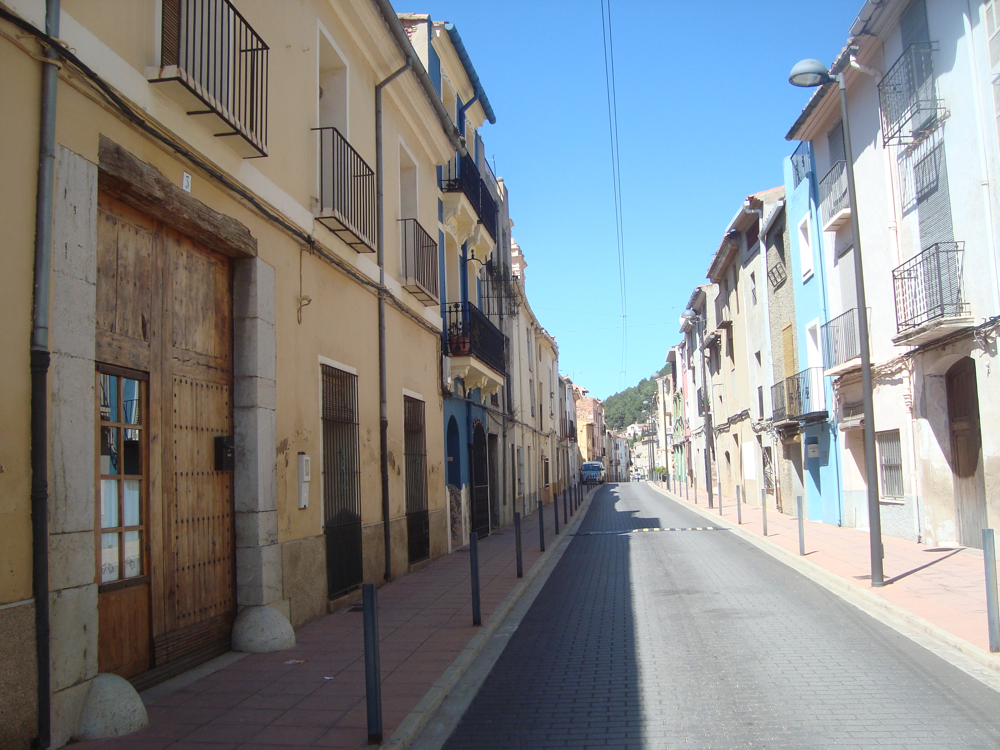
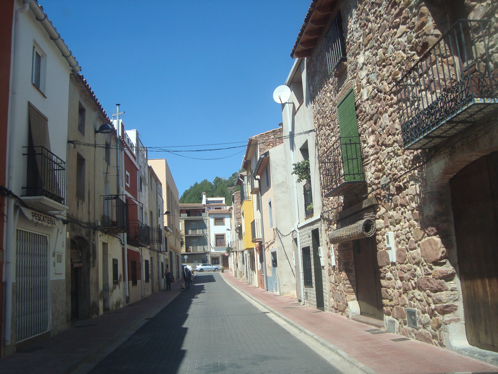
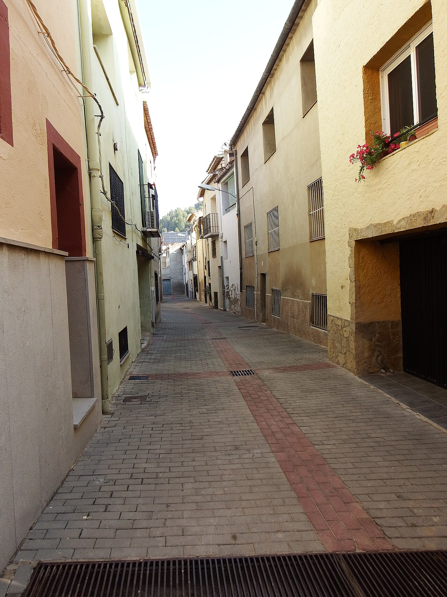

# La Pobla Tornesa street-level references

Fourteen real photographs showing La Pobla Tornesa and its surroundings from ground level, selected as a downloadable alternative to Google Street View. They cover named streets and squares, narrow lanes, facades, paving, street furniture, the church tower, a highway underpass and a bridge on the Coll de la Mola route.

Images **01–12** were downloaded from Wikimedia Commons on **7 September 2026** and were taken in **2016, 2024 and 2026**. Images **13–14** were supplied by the user from Wikiloc and added to this index on **8 September 2026**; their individual capture dates are unverified. The linked route was recorded in **October 2022** and uploaded on **30 October 2022**. These are individual still photographs rather than 360-degree panoramas or continuous coverage of every street.

For the strongest forward-looking walking references, start with **01, 02, 03, 06, 08 and 09**. Use **04–05** for squares, **07, 10–12** for masonry, roof lines, landmarks and facade detail, and **13–14** for the highway underpass and rural bridge.

## Photo index

| Photo | Date taken | Dimensions | Photographer / license |
| --- | --- | --- | --- |
| [01 — Carrer d’Enmig](01-carrer-enmig-2016.jpg) | 2016-04-07 | 3072 × 2304 | Juan Emilio Prades Bel / [CC BY-SA 4.0](https://creativecommons.org/licenses/by-sa/4.0) |
| [02 — Carrer de Baix la Vila](02-carrer-baix-la-vila-2016.jpg) | 2016-04-07 | 3072 × 2304 | Juan Emilio Prades Bel / [CC BY-SA 4.0](https://creativecommons.org/licenses/by-sa/4.0) |
| [03 — Carrer Tossal de la Vila](03-carrer-tossal-de-la-vila-2026.jpg) | 2026-06-08 | 5184 × 3888 | Juan Emilio Prades Bel / [CC BY 4.0](https://creativecommons.org/licenses/by/4.0) |
| [04 — Plaça del Raval](04-placa-del-raval-2026.jpg) | 2026-06-08 | 5184 × 3888 | Juan Emilio Prades Bel / [CC BY 4.0](https://creativecommons.org/licenses/by/4.0) |
| [05 — Plaça del Portal](05-placa-del-portal-2026.jpg) | 2026-06-08 | 5184 × 3888 | Juan Emilio Prades Bel / [CC BY 4.0](https://creativecommons.org/licenses/by/4.0) |
| [06 — Paved lane and low buildings](06-paved-lane-2024.jpg) | 2024-08-22 | 4608 × 3456 | 19Tarrestnom65 / [CC BY-SA 4.0](https://creativecommons.org/licenses/by-sa/4.0) |
| [07 — Narrow passage beside a stone wall](07-stone-wall-passage-2024.jpg) | 2024-08-22 | 3456 × 4608 | 19Tarrestnom65 / [CC BY-SA 4.0](https://creativecommons.org/licenses/by-sa/4.0) |
| [08 — Narrow residential lane](08-narrow-residential-lane-2024.jpg) | 2024-08-22 | 1280 × 1707 | 19Tarrestnom65 / [CC BY-SA 4.0](https://creativecommons.org/licenses/by-sa/4.0) |
| [09 — Street crossing and balconies](09-street-crossing-and-balconies-2024.jpg) | 2024-08-22 | 1280 × 1707 | 19Tarrestnom65 / [CC BY-SA 4.0](https://creativecommons.org/licenses/by-sa/4.0) |
| [10 — Church tower seen from the street](10-church-tower-from-street-2024.jpg) | 2024-08-22 | 3456 × 4608 | 19Tarrestnom65 / [CC BY-SA 4.0](https://creativecommons.org/licenses/by-sa/4.0) |
| [11 — Well and street junction](11-well-and-street-junction-2024.jpg) | 2024-08-22 | 1280 × 1707 | 19Tarrestnom65 / [CC BY-SA 4.0](https://creativecommons.org/licenses/by-sa/4.0) |
| [12 — Whitewashed street facade](12-whitewashed-street-facade-2024.jpg) | 2024-08-22 | 1280 × 960 | 19Tarrestnom65 / [CC BY-SA 4.0](https://creativecommons.org/licenses/by-sa/4.0) |
| [13 — Highway underpass](13-highway-tunnel.jpg) | Unverified | 1600 × 1200 | Vicent Sorribes (route author) / license unspecified |
| [14 — Bridge on the Coll de la Mola route](14-bridge-coll-de-la-mola.jpg) | Unverified | 900 × 1200 | Vicent Sorribes (route author) / license unspecified |

## Reference notes

Among images 01–12, eight JPEGs are full-resolution originals, verified against the source checksums. Images 08, 09, 11 and 12 are complete 1280-pixel-wide previews supplied by Wikimedia; their original downloads were rate-limited. No local image editing was applied to those downloads. Images 13–14 are user-supplied JPEGs, retained as supplied; their original download URLs and prior processing are unknown. The photo index gives the saved images’ dimensions after applying any orientation metadata. Available source links, authors, licenses, capture dates, dimensions and integrity checks are recorded in [`manifest.json`](manifest.json), with unknown metadata left unspecified. A snapshot of the original Commons metadata is saved in [`sources/commons-image-metadata.json`](sources/commons-image-metadata.json), and the Wikiloc source record is saved in [`sources/wikiloc-route-metadata.json`](sources/wikiloc-route-metadata.json).

Five Commons images identify their street or square in the original source title. The other Commons sources identify La Pobla Tornesa without precise camera locations. The user identifies the Coll de la Mola–La Pobla Tornesa Wikiloc route as the source of images 13–14; exact camera positions are unverified. Generic captions describe visible features; they do not assert unverified street names. The well in image 11 is visually matched to Plaça del Portal in image 05. Camera coordinates and viewing directions are left unspecified.

The photographs show the town on their recorded capture dates, so later buildings, street furniture and vehicles need to be considered when using them for the game’s 1998 setting. The original files remain outside the game’s `public/` folder and are available for offline reference. For overhead views and exact game map bounds, see [`satellite-data/`](../satellite-data/README.md).

## Sources and credits

The following links identify the source and available credit for each photograph. For Commons images 01–12, retain the photographer, source link and corresponding license when sharing or displaying them. If adapting a CC BY-SA image, follow its ShareAlike terms and indicate your changes. The Wikiloc page credits the route to Vicent Sorribes but does not specify a photo reuse license; no Creative Commons license is asserted for images 13–14.

- **01:** [Carrer Enmig (La Pobla Tornesa).JPG](https://commons.wikimedia.org/wiki/File:Carrer_Enmig_(La_Pobla_Tornesa).JPG) — Juan Emilio Prades Bel, 2016-04-07, [CC BY-SA 4.0](https://creativecommons.org/licenses/by-sa/4.0). Original photograph, unchanged.
- **02:** [Carrer de Baix la Vila (La Pobla Tornesa).JPG](https://commons.wikimedia.org/wiki/File:Carrer_de_Baix_la_Vila_(La_Pobla_Tornesa).JPG) — Juan Emilio Prades Bel, 2016-04-07, [CC BY-SA 4.0](https://creativecommons.org/licenses/by-sa/4.0). Original photograph, unchanged.
- **03:** [Calle Tossal de la Vila, municipio La Pobla Tornesa, provincia Castellón.jpg](https://commons.wikimedia.org/wiki/File:Calle_Tossal_de_la_Vila,_municipio_La_Pobla_Tornesa,_provincia_Castell%C3%B3n.jpg) — Juan Emilio Prades Bel, 2026-06-08, [CC BY 4.0](https://creativecommons.org/licenses/by/4.0). Original photograph, unchanged.
- **04:** [Plaza del Raval, municipio La Pobla Tornesa, provincia Castellón.jpg](https://commons.wikimedia.org/wiki/File:Plaza_del_Raval,_municipio_La_Pobla_Tornesa,_provincia_Castell%C3%B3n.jpg) — Juan Emilio Prades Bel, 2026-06-08, [CC BY 4.0](https://creativecommons.org/licenses/by/4.0). Original photograph, unchanged.
- **05:** [Plaza del Portal, municipio La Pobla Tornesa, provincia Castellón.jpg](https://commons.wikimedia.org/wiki/File:Plaza_del_Portal,_municipio_La_Pobla_Tornesa,_provincia_Castell%C3%B3n.jpg) — Juan Emilio Prades Bel, 2026-06-08, [CC BY 4.0](https://creativecommons.org/licenses/by/4.0). Original photograph, unchanged.
- **06:** [La Pobla Tornesa estiu 2024 02.jpg](https://commons.wikimedia.org/wiki/File:La_Pobla_Tornesa_estiu_2024_02.jpg) — 19Tarrestnom65, 2024-08-22, [CC BY-SA 4.0](https://creativecommons.org/licenses/by-sa/4.0). Original photograph, unchanged.
- **07:** [La Pobla Tornesa estiu 2024 17.jpg](https://commons.wikimedia.org/wiki/File:La_Pobla_Tornesa_estiu_2024_17.jpg) — 19Tarrestnom65, 2024-08-22, [CC BY-SA 4.0](https://creativecommons.org/licenses/by-sa/4.0). Original photograph, unchanged.
- **08:** [La Pobla Tornesa estiu 2024 18.jpg](https://commons.wikimedia.org/wiki/File:La_Pobla_Tornesa_estiu_2024_18.jpg) — 19Tarrestnom65, 2024-08-22, [CC BY-SA 4.0](https://creativecommons.org/licenses/by-sa/4.0). Wikimedia-provided resized preview; no local edits.
- **09:** [La Pobla Tornesa estiu 2024 20.jpg](https://commons.wikimedia.org/wiki/File:La_Pobla_Tornesa_estiu_2024_20.jpg) — 19Tarrestnom65, 2024-08-22, [CC BY-SA 4.0](https://creativecommons.org/licenses/by-sa/4.0). Wikimedia-provided resized preview; no local edits.
- **10:** [La Pobla Tornesa estiu 2024 27.jpg](https://commons.wikimedia.org/wiki/File:La_Pobla_Tornesa_estiu_2024_27.jpg) — 19Tarrestnom65, 2024-08-22, [CC BY-SA 4.0](https://creativecommons.org/licenses/by-sa/4.0). Original photograph, unchanged.
- **11:** [La Pobla Tornesa estiu 2024 30.jpg](https://commons.wikimedia.org/wiki/File:La_Pobla_Tornesa_estiu_2024_30.jpg) — 19Tarrestnom65, 2024-08-22, [CC BY-SA 4.0](https://creativecommons.org/licenses/by-sa/4.0). Wikimedia-provided resized preview; no local edits.
- **12:** [La Pobla Tornesa estiu 2024 31.jpg](https://commons.wikimedia.org/wiki/File:La_Pobla_Tornesa_estiu_2024_31.jpg) — 19Tarrestnom65, 2024-08-22, [CC BY-SA 4.0](https://creativecommons.org/licenses/by-sa/4.0). Wikimedia-provided resized preview; no local edits.
- **13–14:** [Pobla Tornesa . Bajada Coll de la Mola a La Pobla Tornesa](https://es.wikiloc.com/rutas-senderismo/pobla-tornesa-bajada-coll-de-la-mola-a-la-pobla-tornesa-117785284) — Wikiloc route **117785284**, by **Vicent Sorribes**. Highway underpass (13) and arched rural bridge (14). User-supplied source attribution; individual photographer credits, capture dates and reuse license are unverified. Files retained as supplied.

[Wikimedia Commons collection for La Pobla Tornesa](https://commons.wikimedia.org/wiki/Category:La_Pobla_Tornesa). These photo licenses are separate from the IGN overhead imagery and the game’s OpenStreetMap vector-data attribution.

## Walking-view previews

### Carrer d’Enmig

Long street perspective; narrow sidewalks, balconies, plaster facades, bollards and overhead cables.

Photo: Juan Emilio Prades Bel — [CC BY-SA 4.0](https://creativecommons.org/licenses/by-sa/4.0) — [source](https://commons.wikimedia.org/wiki/File:Carrer_Enmig_(La_Pobla_Tornesa).JPG).

### Carrer de Baix la Vila

Stone and rendered facades, traditional wooden doors, balconies and shopfronts.

Photo: Juan Emilio Prades Bel — [CC BY-SA 4.0](https://creativecommons.org/licenses/by-sa/4.0) — [source](https://commons.wikimedia.org/wiki/File:Carrer_de_Baix_la_Vila_(La_Pobla_Tornesa).JPG).

### Narrow residential lane

Pedestrian-scale alley with plaster facades, iron grilles, balconies, drains and flower boxes.

Photo: 19Tarrestnom65 — [CC BY-SA 4.0](https://creativecommons.org/licenses/by-sa/4.0) — [source](https://commons.wikimedia.org/wiki/File:La_Pobla_Tornesa_estiu_2024_18.jpg).
