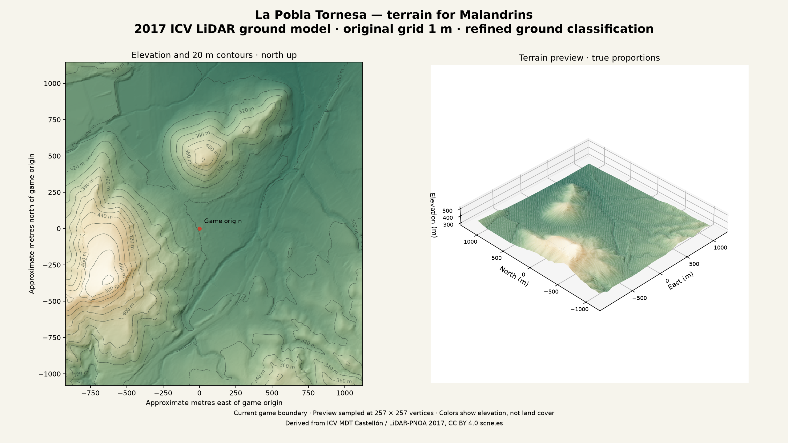

# La Pobla Tornesa — terrain data for Malandrins

**Recommended base terrain: the ICV 2017 LiDAR ground model at 1 m resolution.** Its refined ground classification gives a cleaner foundation for a game with separately modelled buildings. The newer **CNIG 2023 model at 0.5 m** is also saved for finer terrain inspection, but it is provisional and contains conspicuous raised rectangular features in the northwest of this map.

Downloaded on **7 September 2026**. The prepared exports cover the existing game's approximately **2.04 × 2.23 km** geographic extent, including the town and nearby hills. This is the game's boundary, **not the entire municipality**. The game now bundles `derived/icv-2017-heightmap-257.f32` and its JSON sidecar to build the terrain; the other exports remain offline references and authoring assets.

## Start here

| File                                                                   | Purpose                                                                                                                              |
| ---------------------------------------------------------------------- | ------------------------------------------------------------------------------------------------------------------------------------ |
| [ICV ground GeoTIFF, native 1 m](raw/icv-2017-ground-game-area-1m.tif) | **Recommended master for modelling.** Float32 elevations in metres, with georeferencing. Lossless crop from the official 2017 sheet. |
| [ICV terrain mesh, GLB](derived/terrain-icv-2017-game-257.glb)         | **Ready to import into Blender or Three.js.** Aligned with the game's coordinates and scale; 66,049 vertices and 131,072 triangles.  |
| [ICV 1025 × 1025 heightmap](derived/icv-2017-heightmap-1025.png)       | 16-bit heightmap for authoring, with approximately 2 m sampling. Read its [import metadata](derived/icv-2017-heightmap-1025.json).   |
| [ICV 257 × 257 heightmap](derived/icv-2017-heightmap-257.png)          | Lighter mesh reference, with approximately 8 m sampling. Read its [import metadata](derived/icv-2017-heightmap-257.json).            |
| [CNIG ground GeoTIFF, native 0.5 m](derived/ground-game-area-0p5m.tif) | Higher-resolution comparison master; provisional classification.                                                                     |
| [Source comparison](derived/source-comparison.png)                     | Visual comparison showing why ICV is recommended for the base ground.                                                                |
| [ICV terrain preview](derived/terrain-icv-2017-preview.png)            | Shaded elevation, 20 m contours and a 3D overview.                                                                                   |

The heightmaps also have matching `.f32` files containing full-precision floating-point elevations. Equivalent CNIG exports are named `game-heightmap-1025.*`, `game-heightmap-257.*`, and `terrain-game-257.glb`. **Choose the `icv-2017` files for the recommended base.**

## Why this selection

The [ICV dataset description](https://dadesobertes.gva.es/dataset/modelo-digital-del-terreno-mdt-de-lidar-de-1-metro-de-resolucion-de-la-provincia-de-castel-2017) documents a ground model from 2017 LiDAR, refined ground classification and breaklines. Its 1 m grid is distributed as Float32 GeoTIFFs. The saved crop retains the original elevation samples without resampling.

The [CNIG MDT50cm product](https://centrodedescargas.cnig.es/CentroDescargas/modelo-digital-terreno-mdt50cm) has finer spacing, and its local tile records identify **2023** data. However, V1 uses the initial NPC01 classification. The [25 June 2026 release announcement](https://centrodedescargas.cnig.es/CentroDescargas/novedades?codSerie=MDT01) describes the Valencian release as provisional. Grid spacing alone does not establish positional or vertical accuracy.

Both were sampled at the same **1,050,625 game-aligned positions**. The median absolute difference is **0.121 m**, and 95% of absolute differences are below **0.924 m**. In the northwest, the CNIG data has large rectangular features reaching **18.006 m above ICV**, consistent with residual roofs. ICV removes these raised blocks. This supports using ICV for ground geometry; it is an informed source-selection judgment, not an independent survey of accuracy. Some differences elsewhere may represent real changes between 2017 and 2023. See [comparison statistics](derived/source-comparison.json).

Other options considered:

| Option                                                                                       | Assessment for this game                                                                                                                           |
| -------------------------------------------------------------------------------------------- | -------------------------------------------------------------------------------------------------------------------------------------------------- |
| [CNIG MDT02, 2 m](https://centrodedescargas.cnig.es/CentroDescargas/catalogo.do?Serie=MDT02) | Useful national fallback, but the downloaded local 1 m ground model gives a denser base.                                                           |
| Coarser terrain grids and contour-map images                                                 | Suitable for broad scenery or reference, less useful for the town's slopes and road placement. A rendered hillshade is not numeric elevation data. |
| [Classified LiDAR point clouds](https://pnoa.ign.es/pnoa-lidar/productos-a-descarga)         | Useful for later custom classification or extracting objects, but require additional processing. No point-cloud files are included here.           |
| Surface models (MDS/DSM)                                                                     | Include above-ground objects and should not directly become the ground beneath separately built houses and trees.                                  |

## Original data and coverage

- **ICV:** [saved 1 m crop](raw/icv-2017-ground-game-area-1m.tif) from MTN50 sheet **0616**. The approximately 2.07 GB source sheet was read through HTTP byte ranges; only the required 2126 × 2294 crop is retained. [Provenance](sources/icv-crop-provenance.json) records the official source URL, original dimensions and crop details.
- **CNIG north:** [original 0.5 m tile](raw/MDT50CM-ETRS89-H31-0616-5-3-COB3-V1.tif), [official record](https://centrodedescargas.cnig.es/CentroDescargas/detalleArchivo?sec=12759405).
- **CNIG south:** [original 0.5 m tile](raw/MDT50CM-ETRS89-H31-0616-5-4-COB3-V1.tif), [official record](https://centrodedescargas.cnig.es/CentroDescargas/detalleArchivo?sec=12759773).

The two original CNIG tiles include a wider strip of surrounding terrain. Both are complete 7480 × 5080 rasters with 0.5 m cells. Their overlap contains **3,367,200 identical elevation samples**, so the native mosaic introduces no tile seam. All saved game-area rasters and all exported heightmaps have **100% valid coverage**.

The CNIG search also returned zone 30 versions. Inspection showed that those contain only western-edge data and no valid samples at the tested game positions. Their metadata remains in `sources/` for traceability; the incomplete raster candidates were not retained. The **zone 31 originals** are the complete data used in the CNIG exports.

## Coordinate and height conventions

The geographic boundary is west **−0.012**, south **40.092**, east **0.012**, north **40.112**. It is also saved as [GeoJSON](game-area.geojson).

- **ICV native raster:** ETRS89 / UTM zone 30N, **EPSG:25830**, easting/northing in metres.
- **CNIG original rasters:** their embedded CRS is **EPSG:3043**, the north/east-axis definition of ETRS89 / UTM zone 31N. Raster X/Y is handled as easting/northing. The cropped export uses **EPSG:25831**, with the same projection and metre grid but conventional east/north axis declaration.
- **All elevations:** orthometric heights in metres, as documented by the providers. They are not GPS ellipsoidal heights and have not been flattened or vertically exaggerated.
- Native GeoTIFF crops include a small buffer around the projected envelope of the game rectangle. The heightmaps and meshes follow the exact game boundary.

The PNGs are **16-bit grayscale data**, with one shared encoding:

```text
elevation_metres = unsigned_16_bit_pixel / 65535 × 1000
```

Black represents 0 m; white represents 1000 m. Do not auto-normalize, convert to 8-bit, apply sRGB correction, or treat the preview image as a heightmap. Encoding introduces less than **0.008 m** of rounding error; that does not imply the survey is accurate to that amount.

For `.f32`, read little-endian IEEE 754 Float32, with no header. Rows run **north to south**, columns **west to east**, in row-major order. Samples are mesh vertices including both boundary edges. They are not pixel-area centers. Vertex `(column, row)` has:

```text
longitude = west + column / (width - 1) × (east - west)
latitude  = north - row / (height - 1) × (north - south)
```

The GLBs already use the mapping in [MapAdapter.ts](../../src/world/MapAdapter.ts): origin **[−0.0012, 40.1017]**, scale **0.7**, X east, Y up, Z south. Their footprint is approximately **1430.502 × 1558.480 game units**. Do not apply the 0.7 scale a second time.

For the recommended ICV data:

```text
game_y = (elevation_metres - 299.1851501464844) × 0.7
```

This sets the sampled ground at the game origin to zero. CNIG has its own baseline, **299.13751220703125 m**. Each JSON sidecar records the applicable baseline, dimensions and limits. The runtime uses 64 indexed terrain chunks and interpolates the same triangles for roads, land-use overlays, scenery, characters, vehicles and camera clearance. Roads split at grid edges and diagonals to remain above the ground; buildings use level foundations. Collision retains the game's X/Z footprint checks, while movement resamples elevation after each move. See [Terrain.ts](../../src/world/Terrain.ts). The runtime's piecewise planar interpolation can differ slightly from bilinear sampling between source vertices.

Both surveys postdate the game's 1998 setting. Use the existing [historical and current imagery](../satellite-data/README.md) to assess later road works, industrial development and other changes. Ground models do not supply building facades, textures or a historical reconstruction.

## Attribution and reproducibility

Retain **CC BY 4.0** attribution when displaying, adapting or redistributing these data. Suggested credits for the prepared exports:

- **ICV:** “Terrain derived from ICV MDT Castellón / LiDAR-PNOA 2017, CC BY 4.0 scne.es.”
- **CNIG:** “Terrain derived from MDT50cm-cob3 2023, IGN/CNIG, CC BY 4.0 scne.es.”

Link to the applicable source and the [CC BY 4.0 license](https://creativecommons.org/licenses/by/4.0/), and indicate cropping, resampling and mesh generation when distributing the derivatives. These credits are additional to the game's OpenStreetMap attribution. Local metadata and product snapshots are in [sources/](sources/).

[manifest.json](manifest.json) records file sizes, SHA-256 checksums, provider IDs and validation results. To recreate the prepared exports, install the versions in `requirements.txt`, then run:

```sh
python prepare_terrain.py
python compare_sources.py
```

Both preparation steps use the saved rasters offline. `download_icv_crop.py` can re-fetch the ICV crop from the official static source when network access is available. The CNIG manifest records its direct-download POST endpoint and tile IDs; the ordinary download buttons are available on the linked official records.


